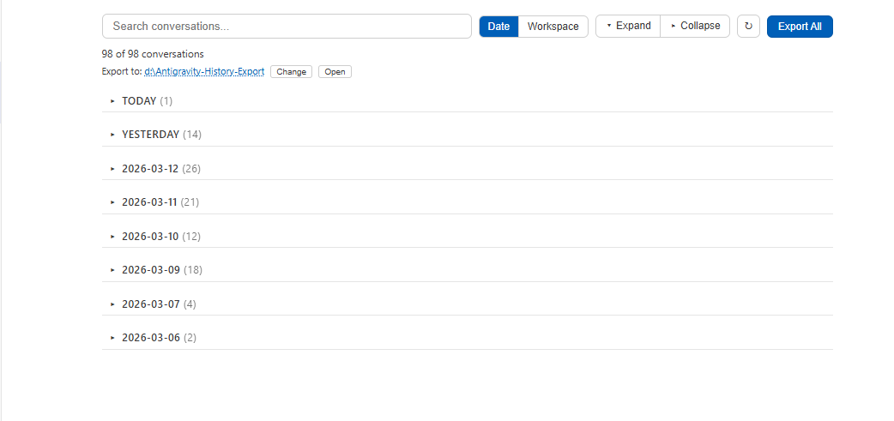
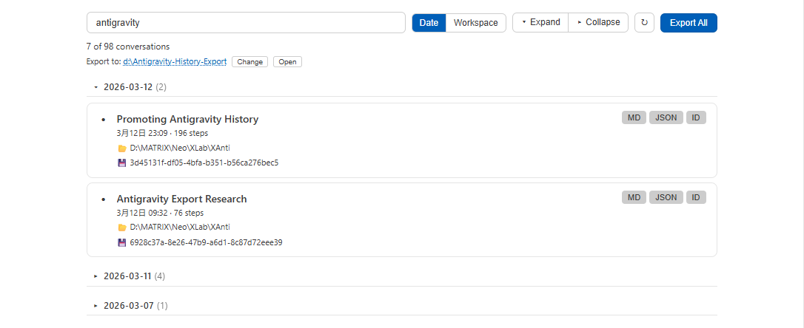
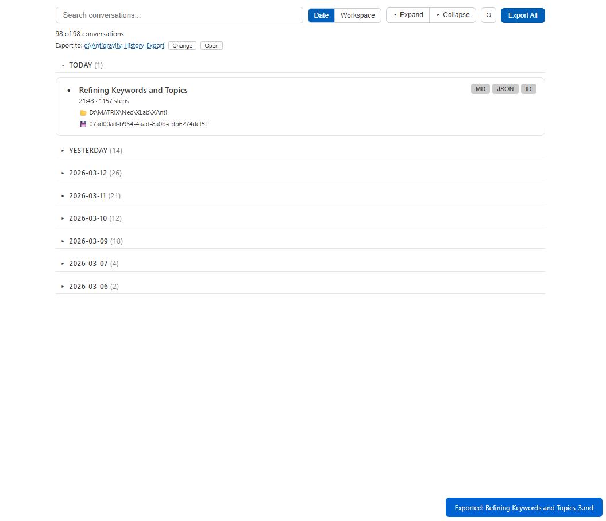

# Antigravity History

[](https://open-vsx.org/extension/neo1027144/antigravity-history)
[](LICENSE)
[](https://github.com/neo1027144-creator/antigravity-history-vscode)

**Browse, search, and export your Antigravity AI conversations — right inside your IDE.**

> *Every conversation is worth keeping. Don't let a single insight slip away.*

[中文说明](#中文说明) | [English](#features)

---



## Features

### 📋 Conversation Dashboard
- See **all conversations** at a glance, grouped by date or workspace
- Quick search by title
- Collapsible groups with expand/collapse all
- Conversation stats: step count, timestamps, status indicator



### 📦 One-Click Export
- Export individual conversations as **Markdown** or **JSON**
- **Bulk export** all conversations with one click
- Configurable export path with visual path selector
- Export completion notification with "Open Folder" action



### 🔄 Auto Recovery
- Automatically discovers and recovers **unindexed conversations** from disk
- Progress bar showing recovery status
- Detects conversations auto-cleaned by Antigravity's 100-conversation limit
- Local JSON cache for **instant startup** after IDE restart

### 🔒 Privacy First
- **100% local** — all data stays on your machine
- **Read-only** — never modifies your Antigravity data
- **No telemetry** — zero external network requests

## Installation

### From VSIX (Manual)
1. Download the `.vsix` file from [Releases](https://github.com/neo1027144/antigravity-history-vscode/releases)
2. In VS Code / Antigravity: `Ctrl+Shift+P` → `Install from VSIX`

### From OpenVSX
Search **"Antigravity History"** in the Extensions panel, or run:
```
ext install neo1027144.antigravity-history
```

## Usage

1. Click the **AG History** button in the status bar (bottom of IDE)
2. The conversation panel opens as an editor tab
3. Browse, search, and export your conversations

## Settings

| Setting | Default | Description |
|---------|---------|-------------|
| `aghistory.exportPath` | `./antigravity_export` | Default export directory |
| `aghistory.exportFormat` | `md` | Export format: `md`, `json`, or `all` |
| `aghistory.fieldLevel` | `thinking` | Detail level: `basic`, `full`, or `thinking` |

## Requirements

- [Antigravity](https://www.antigravity.com/) IDE must be running with at least one active workspace
- Works on **Windows**, **macOS**, and **Linux**

## Roadmap

- 🔜 Conversation content preview
- 🔜 Advanced search (by date range, workspace, step count)
- 🔜 Conversation tagging and favorites
- 🔜 Direct integration with Antigravity chat panel

## Related

- **[antigravity-history](https://github.com/neo1027144/antigravity-history)** — CLI tool for Antigravity conversation export (PyPI: `pip install antigravity-history`)

## License

Apache 2.0 — see [LICENSE](LICENSE)

---

# 中文说明

**在 IDE 内浏览、搜索和导出你的 Antigravity AI 对话记录。**

> *每一段对话都值得留存，别让任何灵感悄然溜走。*


## 功能特性

### 📋 对话管理面板
- 一目了然查看**所有对话**，支持按日期或工作区分组
- 快速搜索对话标题
- 可折叠分组，一键展开/收起
- 对话信息：步数、时间、状态指示


### 📦 一键导出
- 单条导出为 **Markdown** 或 **JSON**
- **批量导出**所有对话
- 可视化导出路径选择器，支持自定义导出目录
- 导出完成后可直接打开文件夹


### 🔄 自动恢复
- 自动发现并恢复**未索引的对话**（从磁盘 `.pb` 文件）
- 进度条显示恢复状态
- 检测被 Antigravity 自动清理的对话（100 条上限）
- 本地 JSON 缓存，IDE 重启后**秒级加载**

### 🔒 隐私优先
- **100% 本地化** — 数据不离开你的电脑
- **只读访问** — 不修改任何 Antigravity 数据
- **零遥测** — 不发送任何外部网络请求

## 安装方式

### 手动安装（VSIX）
1. 从 [Releases](https://github.com/neo1027144/antigravity-history-vscode/releases) 下载 `.vsix` 文件
2. 在 VS Code / Antigravity 中：`Ctrl+Shift+P` → `Install from VSIX`

### 从 OpenVSX 安装
在扩展面板搜索 **"Antigravity History"**，或执行：
```
ext install neo1027144.antigravity-history
```

## 使用方法

1. 点击 IDE 底部状态栏的 **AG History** 按钮
2. 对话面板作为编辑器标签页打开
3. 浏览、搜索、导出你的对话

## 配置项

| 配置项 | 默认值 | 说明 |
|--------|--------|------|
| `aghistory.exportPath` | `./antigravity_export` | 默认导出目录 |
| `aghistory.exportFormat` | `md` | 导出格式：`md`、`json` 或 `all` |
| `aghistory.fieldLevel` | `thinking` | 详细程度：`basic`、`full` 或 `thinking` |

## 开发路线

- 🔜 对话内容预览
- 🔜 高级搜索（按日期范围、工作区、步数）
- 🔜 对话标签与收藏
- 🔜 与 Antigravity 聊天面板直接联动

## 相关项目

- **[antigravity-history](https://github.com/neo1027144/antigravity-history)** — 命令行版对话导出工具（PyPI: `pip install antigravity-history`）

## 许可证

Apache 2.0 — 详见 [LICENSE](LICENSE)
