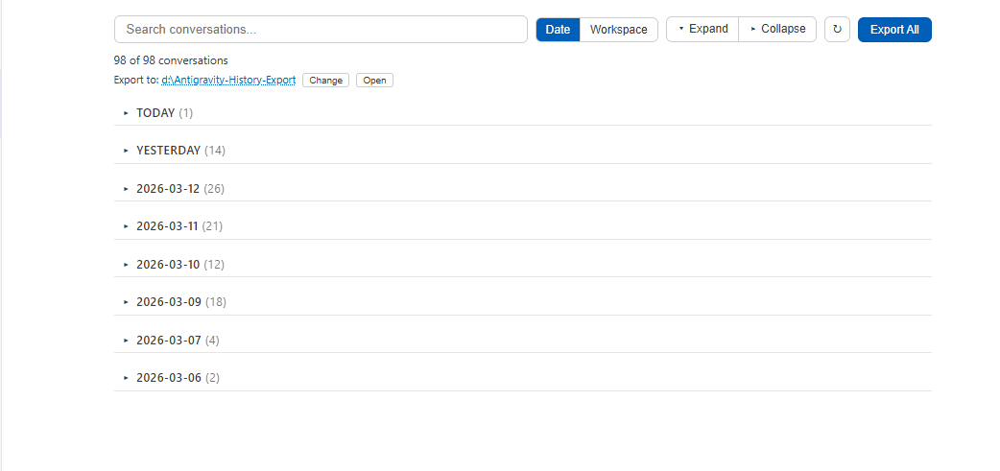
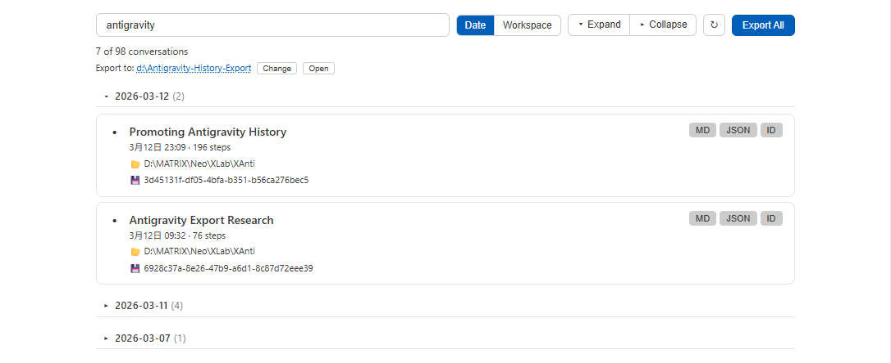
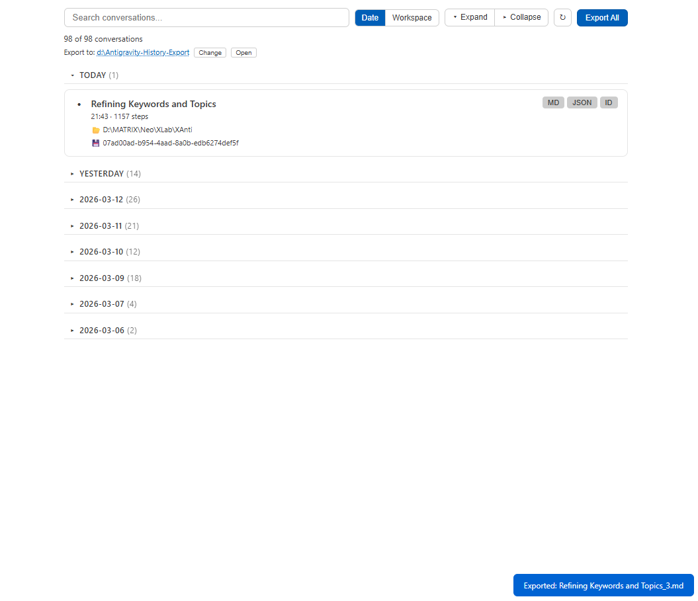

# 每一次提问，都值得被记录。

[English](README.md) | [中文](README_CN.md)

[](https://open-vsx.org/extension/neo1027144/antigravity-history)
[](LICENSE)
[](https://github.com/yunfenghello/antigravity-history-vscode)

> ⚠️ **重要提示：** 使用本插件前，请确保你的 **Antigravity IDE 已升级到最新版本**。旧版本可能导致「Client is not running」错误，无法加载对话列表。👉 [**下载 / 更新 Antigravity**](https://antigravity.google/releases)

**在 IDE 内浏览、搜索和导出你的 Antigravity AI 对话记录。**

> *别让那些灵光乍现的解决方案、调试思路和架构决策悄然消逝。*

---



## 功能特性

### 📋 对话管理面板
- 一目了然查看**所有对话**，支持按日期或工作区分组
- 快速搜索对话标题
- 可折叠分组，一键展开/收起
- 对话信息：步数、时间、状态指示



### 📦 一键导出
- 单条导出为 **Markdown** 或 **JSON**
- **批量导出**所有对话
- 可视化导出路径选择器，支持自定义导出目录
- 导出完成后可直接打开文件夹



### 🔄 自动恢复
- 自动发现并恢复**未索引的对话**（从磁盘 `.pb` 文件）
- 进度条显示恢复状态
- 检测被 Antigravity 自动清理的对话（100 条上限）
- 本地 JSON 缓存，IDE 重启后**秒级加载**

### 🔒 隐私优先
- **100% 本地化** — 数据不离开你的电脑
- **只读访问** — 不修改任何 Antigravity 数据
- **零遥测** — 不发送任何外部网络请求

## 安装方式

### 手动安装（VSIX）
1. 从 [Releases](https://github.com/yunfenghello/antigravity-history-vscode/releases) 下载 `.vsix` 文件
2. 在 VS Code / Antigravity 中：`Ctrl+Shift+P` → `Install from VSIX`

### 从 OpenVSX 安装
在扩展面板搜索 **"Antigravity History"**，或执行：
```
ext install yunfenghello.antigravity-history
```

## 使用方法

1. 点击 IDE 底部状态栏的 **AG History** 按钮
2. 对话面板作为编辑器标签页打开
3. 浏览、搜索、导出你的对话

## 配置项

| 配置项 | 默认值 | 说明 |
|--------|--------|------|
| `aghistory.exportPath` | `./antigravity_export` | 默认导出目录 |
| `aghistory.exportFormat` | `md` | 导出格式：`md`、`json` 或 `all` |
| `aghistory.fieldLevel` | `thinking` | 详细程度：`basic`、`full` 或 `thinking` |

## 环境要求

- [Antigravity](https://antigravity.google/releases) IDE（建议最新版本）
- 至少打开一个工作区
- 已在 **Windows** 上测试验证

## 开发路线

- 🔜 对话内容预览
- 🔜 高级搜索（按日期范围、工作区、步数）
- 🔜 对话标签与收藏
- 🔜 与 Antigravity 聊天面板直接联动

## 相关项目

- **[antigravity-history](https://github.com/neo1027144-creator/antigravity-history)** — 命令行版对话导出工具（PyPI: `pip install antigravity-history`）

## 许可证

Apache 2.0 — 详见 [LICENSE](LICENSE)
